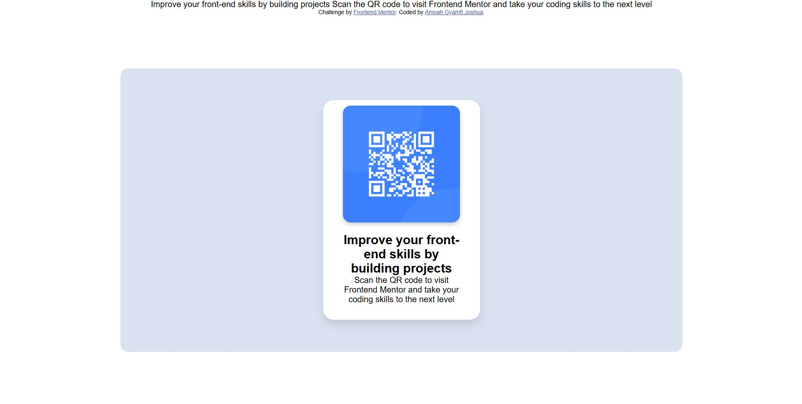

# Frontend Mentor - QR code component solution

This is a solution to the [QR code component challenge on Frontend Mentor](https://www.frontendmentor.io/challenges/qr-code-component-iux_sIO_H). Frontend Mentor challenges help you improve your coding skills by building realistic projects. 

## Table of contents

- [Overview](#overview)
  - [Screenshot](#screenshot)
  - [Links](#links)
- [My process](#my-process)
  - [Built with](#built-with)
  - [What I learned](#what-i-learned)
  - [Continued development](#continued-development)
  - [Useful resources](#useful-resources)
- [Author](#author)

**Note: Delete this note and update the table of contents based on what sections you keep.**

## Overview

### Screenshot



### Links

- Solution URL: [Add solution URL here](https://your-solution-url.com)
- Live Site URL: [Add live site URL here](https://your-live-site-url.com)

## My process

### Built with

- Semantic HTML5 markup
- CSS custom properties
- Flexbox
- Mobile-first workflow

### What I learned

I was able to make the component responsive and I am very proud.

```css
@media screen and (max-width: 600px) {
  //rest of code...
}
```
### Continued development

styling components still feel like a lot for me and I hope to get better.

### Useful resources

- [resource 1](https://www.browserstack.com/guide/responsive-design-breakpoints) - This helped me to implement the mobile breakpoint of the component. I really liked it and will use it going forward.

## Author

- Website - [Amoah Gyamfi Joshua](https://www.your-site.com)
- Frontend Mentor - [@Joshua-Gyamfi](https://www.frontendmentor.io/profile/Joshua-Gyamfi)
- Twitter - [@gyamfi_aj](https://www.twitter.com/gyamfi_aj)
